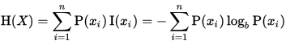

# Decision Trees:
Decision trees use a trick to let you do non-linear decision with simple,linear decision surfaces. 

Let's focus on some basic concepts:

### min_samples_split(parameter):
It is the value untill which tree should divide or splits.
 
*For example : min_samples_split = 2 will be more complex as compared to min_samples_split = 50*

**And the interesting part is, accuracy with min_samples_split=50 has high accuracy as compared to the value with min_samples_split=2**

### Entropy 
Entropy controls how decision tree decides where to split the data. Other name for entropy is impurity.

*For example, in a self driving car, how much the car should go in case of bumpiness, is controlled by entropy.*
 
**Formulae**

It ranges from 0 to 1. 
**Think** : When the value of entropy will come 1?

Ans : When the two classes are evenly distributed. Similarly if there is only one class(no classification), then entropy(impurity) will come out to be 0.

### Information Gain 
**Formulae**
Information Gain = entropy(parent) - (weighted average)*(entropy(children))

*Two types of machinery terms called as **Bias** and **Variance**.*
 
**Bias** : A bias machine learning algorithm is one that practically ignores the data. It has almost no capacity to learn anything
 
**Variance** : Model that extremely perceptive to the data and it can replicate itself if it has seen before. So it will react very poorly in situations it hasn't seen before as it doesn't have the right bias to generalize to new stuff.

### Time to Code
Calculate the accuracy using Decision Tree classifier with min_samples_split=40.(It may take some time to train)
 Accuracy : 0.977246871  
**Note** : If we go into <a href="https://github.com/bodhwani/Machine-Learning/blob/master/Assignments/tools/email_preprocess.py">tools/email_preprocess.py</a>, and find the line of code that looks like this:     selector = SelectPercentile(f_classif, percentile=1)  Change percentile from 10 to 1.
Basically we are reducing out training data as Decision trees are not used in very large dataset.  
After reducing from 3785 columns to 379 columns(in out dataset), we get an accuracy of 0.967007963594.Isn't it awesome! 
Checkout the <a href="https://github.com/bodhwani/Machine-Learning/tree/master/_Solutions/decision_tree/dt_author_id.py">answer(code)</a>, if you stuck anywhere.Good Luck!

