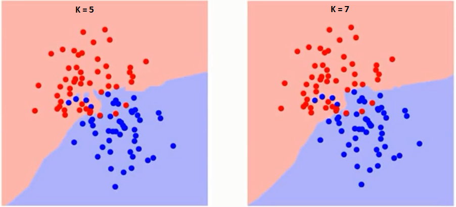

# Choose your own algorithm

A critical skill for any data analyst is the ability to figure out new things about machine learning. The whole lesson is a mini-project. The goal is to do terrain classification with an algorithm of your choice, researching and deploying it on your own.

This topic will contain three classifications :
- k nearest neighbors
- random forest
- adaboost (sometimes also called boosted decision tree)

### Some tips :
If you are brand new to machine learning and you've never done it before or its still kind of challenge to understand the algorithms, go for k-nearest neighbours. It is very simple and easy to understand, which is a big advantage in machine learning.
 
The rest of the two will be having many classifiers, and you sort of have them all working together to come up with single decision. Its like who's the president going to be and you ask from different people who have different opinions on what the answer should be and all together you come up with single answer.

## Let's Start :
### K Nearest Neighbours
K-nearest neighbors (KNN) can be used for both classification and regression predictive problems. It is commonly used for its easy of interpretation and low calculation time. 

First let us try to understand what exactly does K influence in the algorithm. If we see the last example, given that all the 6 training observation remain constant, with a given K value we can make boundaries of each class. These boundaries will segregate RC from GS. The same way, let’s try to see the effect of value “K” on the class boundaries. Following are the different boundaries separating the two classes with different values of K.

 

If you watch carefully, you can see that the boundary becomes smoother with increasing value of K. With K increasing to infinity it finally becomes all blue or all red depending on the total majority

It is also a lazy algorithm. What this means is that it does not use the training data points to do any generalization. In other words, there is no explicit training phase or it is very minimal. This means the training phase is pretty fast . Lack of generalization means that KNN keeps all the training data. More exactly, all the training data is needed during the testing phase. This is in contrast to other techniques like SVM where you can discard all non support vectors without any problem.  Most of the lazy algorithms – especially KNN – makes decision based on the entire training data set (in the best case a subset of them).

### Random Forest
Random forest algorithm is a supervised classification algorithm. As the name suggest, this algorithm creates the forest with a number of trees.
 
In general, the more trees in the forest the more robust the forest looks like. In the same way in the random forest classifier, the higher the number of trees in the forest gives the high accuracy results.

### Why Random forest algorithm

To address why random forest algorithm here are some of the advantages:

- The same random forest algorithm or the random forest classifier can use for both classification and the regression task.
- Random forest classifier will handle the missing values.
- When we have more trees in the forest, random forest classifier won’t overfit the model.
- Can model the random forest classifier for categorical values also.

### Adaboost Classifier :
AdaBoost was the first really successful boosting algorithm developed for binary classification. It is the best starting point for understanding boosting.
AdaBoost is best used to boost the performance of decision trees on binary classification problems.
 
AdaBoost can be used to boost the performance of any machine learning algorithm. It is best used with weak learners. These are models that achieve accuracy just above random chance on a classification problem.
 The most suited and therefore most common algorithm used with AdaBoost are decision trees with one level. Because these trees are so short and only contain one decision for classification, they are often called decision stumps.

### Output 
Calculate the accuracies of every classifier and compare. <a href="https://github.com/bodhwani/Machine-Learning/blob/master/_Solutions/choose_your_own/your_algorithm.py">Here is the code for finding accuracy.</a>
Accuracy according to the classifiers above :
- ('Accuracy for KNN classifier is ', 0.97333333333333338)
- ('Accuracy for RANDOM FOREST classifier is ', 0.92000000000000004)
- ('Accuracy for ADABOOST classifier is ', 0.92400000000000004)
