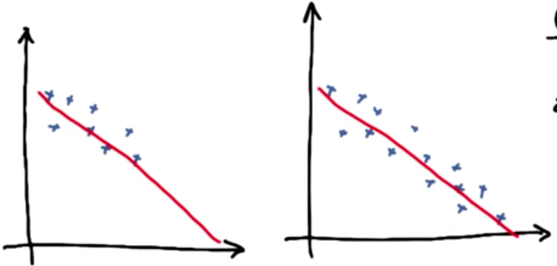

# Regression - Continous Supervised Learning

Best option to distinguish between **Discrete** and **Continous** values, can be :
If your previous value is dependent on next value, then it will be continous. Else, it will be discrete.

In case of continous, there is some sort of ordering(a relationship) between values.

- One point to note here is, you have to give your input value, in form of list, if you want to predict.
- You need to know what are the coefficients(slope) and intercept is. You can access these, using reg.coef_ and reg_intercept_ [Here, reg is the  name of the linear regression model].

- **Error** in regression, can be calculated as [Actual output - predicted output]^2.

#### So the game in linear regression, is to find m and b, in equation y=mx+b, such a way that it will minimize the error.

**There are several algorithms, to minimize the squared errors :**

- Ordinary least squared 
- Gradient Descent

But there is disadvantage, for using ordinary least squared error.
Consider the below figure.




They both seems like doing a good job in fitting our model. But the sum of squared error for the right one, is greater than the left one.

Hence, **if you add more data, then the sum of squared error will almost certainly go up, but its not necessarily mean that your fit is doing a worse job.**

Solution to this can be **R squared** of regression.

It is defined as, how much of my change in the output is explained by the change in my input.
Range of r squared is between 0 and 1. 
**If your r squared value comes near to 0, then your model is not doing a good job**.On the other hand, if it closer to 1, your model is doing a good job.
Advantage : It is not affected by number of points, in the dataset.

Plotting graphs in linear regression, is very important. So lets see how.
```sh
plt.scatter(input,output)
plt.plot(input, reg.predict(input),color="blue",linewidth=2)
plt.xlabel("x-label")
plt.ylabel("y-label")
plt.show()

```


| Property | Supervised classification | Regression |
| --- | --- | --- |
| output type | Discrete | Continous |
| What are you trying to find | Decision boundary | Best fit line |
| Evaluate | Accuracy  | R squared value |


